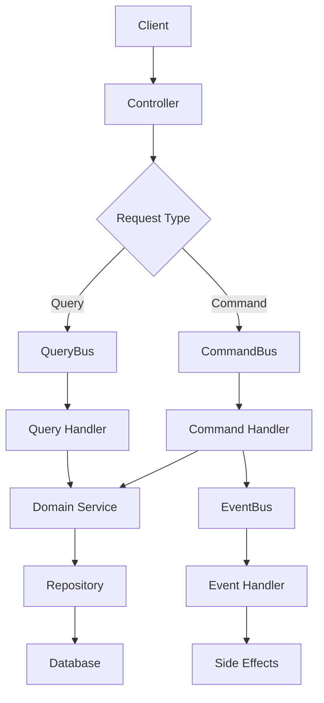

# 🏨 Booking System with NestJS & CQRS

سیستم رزرواسیون پیشرفته با استفاده از NestJS، CQRS، و Domain-Driven Design

[](https://www.typescriptlang.org/)
[](https://nestjs.com/)
[](https://martinfowler.com/bliki/CQRS.html)
[](https://www.docker.com/)
[](https://www.postgresql.org/)
[](https://redis.io/)

## 🚀 Quick Start

```bash
# Clone repository
git clone https://github.com/emadansari96/Booking-System.git
cd Booking-System

# Install dependencies
bun install

# Setup environment
cp .env.example .env

# Start services
docker-compose up -d

# Run application
bun run dev
```

## ✨ Features

### 🏗️ Architecture
- **CQRS**: Command Query Responsibility Segregation
- **DDD**: Domain-Driven Design
- **Event-Driven**: Event-driven architecture
- **Clean Architecture**: Layered architecture
- **SOLID Principles**: Object-oriented design

### 🔧 Technology Stack
- **Backend**: NestJS, TypeScript
- **Database**: PostgreSQL with GiST index
- **Cache**: Redis
- **ORM**: TypeORM
- **Container**: Docker
- **Package Manager**: Bun

### 🛡️ Security
- **Data Hashing**: Sensitive data protection
- **JWT**: Authentication
- **Role-based**: Authorization
- **Input Validation**: DTO validation
- **SQL Injection**: Prevention

### 📊 Performance
- **Redis Caching**: Fast data access
- **Connection Pooling**: Database optimization
- **GiST Index**: Overlap prevention
- **Distributed Locking**: Concurrency control

## 🏛️ Architecture

### CQRS Flow


### Domain Structure
```
src/domains/user-management/
├── commands/           # Commands (Write)
├── queries/            # Queries (Read)
├── events/             # Events (Side Effects)
├── cqrs/              # CQRS Buses
├── controllers/        # Controllers
├── services/           # Domain Services
└── dtos/              # Data Transfer Objects
```

## 🔧 API Endpoints

### Regular Endpoints
- `POST /users` - Create user
- `GET /users/:id` - Get user by ID
- `PUT /users/:id` - Update user
- `DELETE /users/:id` - Deactivate user

### CQRS Endpoints
- `POST /users-cqrs` - Create user (CQRS)
- `GET /users-cqrs/:id` - Get user by ID (CQRS)
- `PUT /users-cqrs/:id` - Update user (CQRS)
- `DELETE /users-cqrs/:id` - Deactivate user (CQRS)

### Documentation
- **Swagger UI**: http://localhost:3000/api/docs

## 🧪 Testing

```bash
# Unit tests
bun run test

# Integration tests
bun run test:e2e

# Test coverage
bun run test:cov

# Watch mode
bun run test:watch
```

## 🐳 Docker

```bash
# Start all services
docker-compose up -d

# Stop all services
docker-compose down

# View logs
docker-compose logs -f

# Clean up
docker-compose down -v
```

## 📚 Documentation

- **[CQRS Guide](docs/CQRS-User-Management.md)**: CQRS implementation
- **[Architecture](docs/Architecture.md)**: System architecture
- **[Development](docs/Development-Guide.md)**: Development workflow
- **[Project Summary](PROJECT-SUMMARY.md)**: Project overview
- **[TODO](TODO.md)**: Task management

## 🏗️ Development

### Prerequisites
- Node.js 18+
- Bun 1.0+
- Docker & Docker Compose
- PostgreSQL 13+
- Redis 6+

### Commands
```bash
# Development
bun run dev          # Start dev server
bun run build        # Build app
bun run start:prod   # Start production

# Testing
bun run test         # Run tests
bun run test:e2e     # E2E tests
bun run test:cov     # Coverage

# Code Quality
bun run lint         # Lint code
bun run format       # Format code

# Database
bun run migration:run    # Run migrations
bun run migration:revert # Revert migration
```

## 🎯 Design Patterns

### CQRS Pattern
- **Commands**: Write operations
- **Queries**: Read operations
- **Events**: Side effects
- **Buses**: Routing and dispatching

### Domain-Driven Design
- **Entities**: Business objects with identity
- **Value Objects**: Immutable objects
- **Aggregates**: Consistency boundaries
- **Domain Events**: Business events

### Repository Pattern
- **Abstraction**: Data access layer
- **Implementation**: TypeORM repositories
- **Interface**: Domain contracts

## 📊 Performance

### Caching Strategy
- **L1**: In-memory cache
- **L2**: Redis cache
- **L3**: Database

### Database Optimization
- **Indexes**: Performance indexes
- **Connection Pooling**: Connection management
- **Query Optimization**: Efficient queries

### Scalability
- **Horizontal Scaling**: Stateless design
- **Load Balancing**: Multiple instances
- **Microservices**: Domain separation

## 🔐 Security

### Data Protection
- **Hashing**: Sensitive data
- **Encryption**: Data at rest
- **Validation**: Input validation

### Authentication
- **JWT**: Token-based auth
- **Roles**: Role-based access
- **Permissions**: Fine-grained control

## 🚀 Deployment

### Production
```bash
# Build application
bun run build

# Start production
bun run start:prod

# Docker production
docker-compose -f docker-compose.prod.yml up -d
```

### Environment Variables
```bash
# Database
DB_HOST=localhost
DB_PORT=5432
DB_USERNAME=booking_user
DB_PASSWORD=booking_password
DB_DATABASE=booking_system

# Redis
REDIS_HOST=localhost
REDIS_PORT=6379
REDIS_PASSWORD=

# Application
NODE_ENV=production
PORT=3000
```

## 🤝 Contributing

1. Fork the repository
2. Create a feature branch
3. Make your changes
4. Add tests
5. Submit a pull request

### Commit Convention
- `feat`: New feature
- `fix`: Bug fix
- `docs`: Documentation
- `style`: Code style
- `refactor`: Code refactoring
- `test`: Tests
- `chore`: Maintenance

## 📝 License

MIT License - see [LICENSE](LICENSE) file

## 📞 Support

- **Issues**: [GitHub Issues](https://github.com/emadansari96/Booking-System/issues)
- **Discussions**: [GitHub Discussions](https://github.com/emadansari96/Booking-System/discussions)
- **Email**: support@booking-system.com

## 🎉 Acknowledgments

- **NestJS Team**: For the amazing framework
- **TypeORM Team**: For the excellent ORM
- **Redis Team**: For the powerful cache
- **PostgreSQL Team**: For the robust database

## 📈 Roadmap

### Phase 1 ✅
- [x] User Management Domain
- [x] CQRS Implementation
- [x] Basic Infrastructure

### Phase 2 🚧
- [ ] Booking Domain
- [ ] Resource Management
- [ ] Payment Integration

### Phase 3 📋
- [ ] Notification System
- [ ] Audit Trail
- [ ] Real-time Features

### Phase 4 🔮
- [ ] Advanced Features
- [ ] Performance Optimization
- [ ] Microservices

---

**Made with ❤️ by [Emad Ansari](https://github.com/emadansari96)**