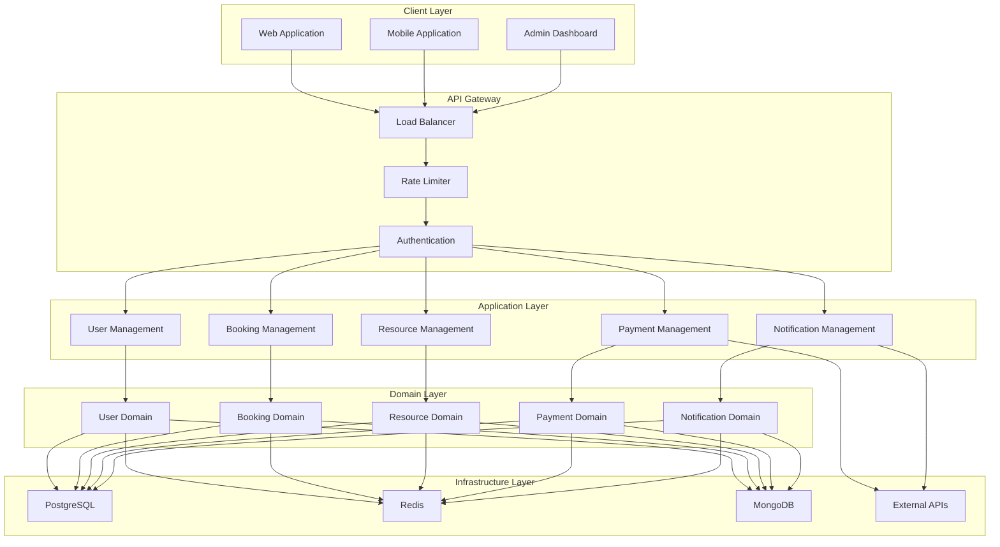
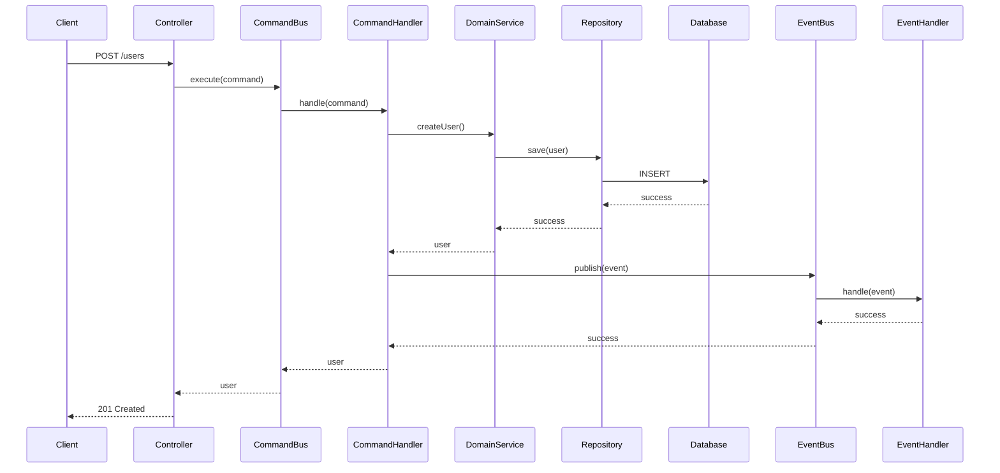
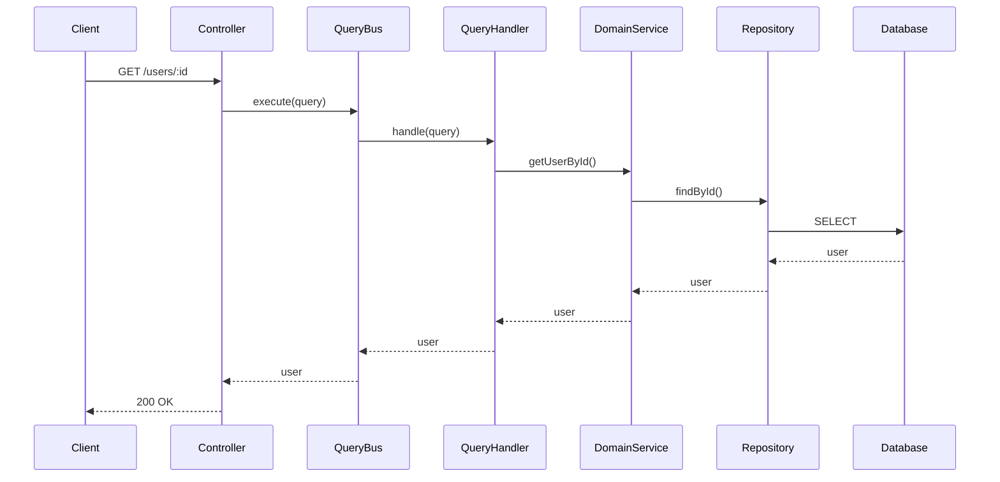

# Architecture Documentation - Booking System

## 🏗️ System Architecture

### High-Level Architecture



## 🎯 Design Principles

### 1. Domain-Driven Design (DDD)
- **Bounded Contexts**: هر domain یک context جداگانه دارد
- **Ubiquitous Language**: زبان مشترک بین business و development
- **Aggregates**: consistency boundaries برای entities
- **Value Objects**: immutable objects برای concepts
- **Domain Events**: events برای business logic

### 2. CQRS (Command Query Responsibility Segregation)
- **Commands**: عملیات نوشتن و business logic
- **Queries**: عملیات خواندن و data retrieval
- **Events**: side effects و notifications
- **Buses**: routing و dispatching

### 3. Event-Driven Architecture
- **Domain Events**: business events
- **Integration Events**: cross-domain events
- **Event Handlers**: processing events
- **Event Store**: event persistence

### 4. Clean Architecture
- **Dependency Inversion**: dependencies point inward
- **Interface Segregation**: small, focused interfaces
- **Single Responsibility**: one reason to change
- **Open/Closed**: open for extension, closed for modification

## 🏛️ Layer Architecture

### 1. Presentation Layer
```typescript
// Controllers
@Controller('users')
export class UserController {
  constructor(private readonly commandBus: CommandBus) {}
  
  @Post()
  async createUser(@Body() dto: CreateUserDto) {
    const command = new CreateUserCommand(dto);
    return await this.commandBus.execute(command);
  }
}
```

### 2. Application Layer
```typescript
// Command Handlers
@Injectable()
export class CreateUserHandler {
  async handle(command: CreateUserCommand) {
    // Business logic
    const user = await this.userService.createUser(command);
    
    // Publish event
    await this.eventBus.publish(new UserCreatedEvent(...));
    
    return user;
  }
}
```

### 3. Domain Layer
```typescript
// Domain Entities
export class User extends AggregateRoot {
  constructor(
    public readonly id: UUID,
    public readonly email: Email,
    public readonly name: Name,
    public readonly phone: PhoneNumber,
    public readonly role: UserRole
  ) {
    super();
  }
  
  changeEmail(newEmail: Email): void {
    this.email = newEmail;
    this.addDomainEvent(new UserEmailChangedEvent(this.id, newEmail));
  }
}
```

### 4. Infrastructure Layer
```typescript
// Repositories
@Injectable()
export class TypeOrmUserRepository implements UserRepository {
  async save(user: User): Promise<void> {
    const entity = this.mapToEntity(user);
    await this.repository.save(entity);
  }
}
```

## 🔄 CQRS Flow

### Command Flow


### Query Flow


## 🗄️ Data Architecture

### 1. PostgreSQL (Main Database)
```sql
-- Users table
CREATE TABLE users (
    id UUID PRIMARY KEY,
    email_hash VARCHAR(255) NOT NULL,
    first_name_hash VARCHAR(255) NOT NULL,
    last_name_hash VARCHAR(255) NOT NULL,
    phone_hash VARCHAR(255) NOT NULL,
    role VARCHAR(50) NOT NULL,
    is_active BOOLEAN DEFAULT true,
    avatar_url VARCHAR(500),
    last_login_at TIMESTAMPTZ,
    created_at TIMESTAMPTZ DEFAULT NOW(),
    updated_at TIMESTAMPTZ DEFAULT NOW()
);

-- Bookings table
CREATE TABLE bookings (
    id UUID PRIMARY KEY,
    user_id UUID NOT NULL REFERENCES users(id),
    status VARCHAR(50) NOT NULL,
    total_amount DECIMAL(10,2) NOT NULL,
    created_at TIMESTAMPTZ DEFAULT NOW(),
    updated_at TIMESTAMPTZ DEFAULT NOW()
);

-- Booking items table
CREATE TABLE booking_items (
    id UUID PRIMARY KEY,
    booking_id UUID NOT NULL REFERENCES bookings(id),
    resource_id UUID NOT NULL,
    start_at TIMESTAMPTZ NOT NULL,
    end_at TIMESTAMPTZ NOT NULL,
    period TSTZRANGE GENERATED ALWAYS AS (tstzrange(start_at, end_at, '[)')) STORED,
    status VARCHAR(50) NOT NULL,
    CHECK (start_at < end_at)
);

-- GiST index for overlap prevention
CREATE INDEX ON booking_items USING GIST (resource_id, period);
ALTER TABLE booking_items ADD CONSTRAINT no_overlap_per_resource 
EXCLUDE USING GIST (resource_id WITH =, period WITH &&) 
WHERE (status IN ('PENDING','CONFIRMED'));
```

### 2. Redis (Cache & Distributed Locking)
```typescript
// Cache keys
const CACHE_KEYS = {
  USER: 'user:',
  USER_SEARCH: 'user:search:index',
  BOOKING: 'booking:',
  RESOURCE: 'resource:',
  AUDIT: 'audit:'
};

// Distributed locking
const LOCK_KEYS = {
  USER_CREATE: 'lock:user:create:',
  BOOKING_CREATE: 'lock:booking:create:',
  RESOURCE_UPDATE: 'lock:resource:update:'
};
```

### 3. MongoDB (Audit Trail)
```typescript
// Audit document structure
interface AuditDocument {
  _id: ObjectId;
  entityType: string;
  entityId: string;
  action: string;
  changes: any;
  userId: string;
  timestamp: Date;
  metadata: {
    ip: string;
    userAgent: string;
    sessionId: string;
  };
}
```

## 🔐 Security Architecture

### 1. Authentication
```typescript
// JWT Token structure
interface JWTToken {
  sub: string; // user id
  email: string;
  role: string;
  iat: number; // issued at
  exp: number; // expires at
}
```

### 2. Authorization
```typescript
// Role-based permissions
const PERMISSIONS = {
  USER: {
    CREATE: 'user:create',
    READ: 'user:read',
    UPDATE: 'user:update',
    DELETE: 'user:delete'
  },
  BOOKING: {
    CREATE: 'booking:create',
    READ: 'booking:read',
    UPDATE: 'booking:update',
    CANCEL: 'booking:cancel'
  }
};
```

### 3. Data Protection
```typescript
// Hashing sensitive data
class HashingService {
  hashSensitiveData(data: string): string {
    return crypto.createHmac('sha256', this.secretKey)
      .update(data)
      .digest('hex');
  }
  
  createSearchableHash(data: string): string {
    // Create partial search capability
    const normalized = data.toLowerCase().trim();
    return this.hashSensitiveData(normalized);
  }
}
```

## 📊 Performance Architecture

### 1. Caching Strategy
```typescript
// Multi-level caching
class CacheStrategy {
  // L1: In-memory cache (fastest)
  private memoryCache = new Map();
  
  // L2: Redis cache (fast)
  private redisCache: RedisService;
  
  // L3: Database (slowest)
  private database: Repository;
  
  async get(key: string): Promise<any> {
    // Try L1 first
    if (this.memoryCache.has(key)) {
      return this.memoryCache.get(key);
    }
    
    // Try L2
    const cached = await this.redisCache.get(key);
    if (cached) {
      this.memoryCache.set(key, cached);
      return cached;
    }
    
    // Fallback to L3
    const data = await this.database.findOne(key);
    await this.redisCache.set(key, data, 3600);
    this.memoryCache.set(key, data);
    return data;
  }
}
```

### 2. Database Optimization
```sql
-- Indexes for performance
CREATE INDEX idx_users_email_hash ON users(email_hash);
CREATE INDEX idx_users_phone_hash ON users(phone_hash);
CREATE INDEX idx_users_role ON users(role);
CREATE INDEX idx_users_created_at ON users(created_at);

-- Partial indexes for active users
CREATE INDEX idx_users_active ON users(id) WHERE is_active = true;

-- Composite indexes for complex queries
CREATE INDEX idx_booking_items_resource_status ON booking_items(resource_id, status);
CREATE INDEX idx_booking_items_period ON booking_items USING GIST (period);
```

### 3. Connection Pooling
```typescript
// Database connection pool
const dbConfig = {
  type: 'postgres',
  host: process.env.DB_HOST,
  port: parseInt(process.env.DB_PORT),
  username: process.env.DB_USERNAME,
  password: process.env.DB_PASSWORD,
  database: process.env.DB_DATABASE,
  poolSize: 20,
  acquireTimeoutMillis: 30000,
  idleTimeoutMillis: 30000,
  max: 20,
  min: 5
};
```

## 🚀 Deployment Architecture

### 1. Docker Containers
```yaml
# docker-compose.yml
version: '3.8'
services:
  app:
    build: .
    ports:
      - "3000:3000"
    environment:
      - NODE_ENV=production
    depends_on:
      - postgres
      - redis
  
  postgres:
    image: postgres:15-alpine
    environment:
      POSTGRES_DB: booking_system
    volumes:
      - postgres_data:/var/lib/postgresql/data
  
  redis:
    image: redis:7-alpine
    volumes:
      - redis_data:/data
```

### 2. Load Balancing
```nginx
# nginx.conf
upstream booking_system {
    server app1:3000;
    server app2:3000;
    server app3:3000;
}

server {
    listen 80;
    location / {
        proxy_pass http://booking_system;
        proxy_set_header Host $host;
        proxy_set_header X-Real-IP $remote_addr;
    }
}
```

### 3. Monitoring
```typescript
// Health check endpoints
@Controller('health')
export class HealthController {
  @Get()
  async checkHealth() {
    return {
      status: 'ok',
      timestamp: new Date().toISOString(),
      services: {
        database: await this.checkDatabase(),
        redis: await this.checkRedis(),
        mongodb: await this.checkMongoDB()
      }
    };
  }
}
```

## 🔄 Event Flow Architecture

### 1. Domain Events
```typescript
// Domain event structure
abstract class DomainEvent {
  constructor(
    public readonly aggregateId: string,
    public readonly occurredOn: Date = new Date()
  ) {}
}

// User created event
class UserCreatedEvent extends DomainEvent {
  constructor(
    public readonly userId: string,
    public readonly email: string,
    public readonly firstName: string,
    public readonly lastName: string,
    public readonly phone: string,
    public readonly role: UserRole
  ) {
    super(userId);
  }
}
```

### 2. Event Handlers
```typescript
// Event handler
@Injectable()
export class UserCreatedHandler {
  constructor(
    private readonly redisService: RedisService,
    private readonly notificationService: NotificationService
  ) {}
  
  async handle(event: UserCreatedEvent): Promise<void> {
    // Cache user data
    await this.redisService.set(
      `user:${event.userId}`,
      JSON.stringify({
        id: event.userId,
        email: event.email,
        firstName: event.firstName,
        lastName: event.lastName,
        phone: event.phone,
        role: event.role
      }),
      3600
    );
    
    // Send welcome notification
    await this.notificationService.sendWelcomeEmail(
      event.email,
      event.firstName
    );
  }
}
```

## 📈 Scalability Architecture

### 1. Horizontal Scaling
```typescript
// Stateless application design
@Injectable()
export class UserService {
  // No instance variables that store state
  // All state is stored in database or cache
  
  async createUser(command: CreateUserCommand): Promise<User> {
    // Business logic only
    // No stateful operations
  }
}
```

### 2. Database Sharding
```typescript
// Sharding strategy
class ShardingStrategy {
  getShardKey(userId: string): string {
    // Consistent hashing for shard selection
    const hash = crypto.createHash('md5').update(userId).digest('hex');
    const shardNumber = parseInt(hash.substring(0, 8), 16) % this.shardCount;
    return `shard_${shardNumber}`;
  }
}
```

### 3. Caching Strategy
```typescript
// Distributed caching
class DistributedCache {
  async get(key: string): Promise<any> {
    // Try local cache first
    if (this.localCache.has(key)) {
      return this.localCache.get(key);
    }
    
    // Try distributed cache
    const value = await this.redis.get(key);
    if (value) {
      this.localCache.set(key, value);
      return value;
    }
    
    return null;
  }
}
```

## 🎯 Conclusion

این معماری به شما امکان ساخت یک سیستم booking system مقیاس‌پذیر، قابل نگهداری و با عملکرد بالا را می‌دهد. استفاده از CQRS، DDD و Event-Driven Architecture باعث می‌شود که سیستم شما:

- **قابل مقیاس** باشد
- **قابل نگهداری** باشد
- **قابل تست** باشد
- **قابل توسعه** باشد
- **قابل اعتماد** باشد
