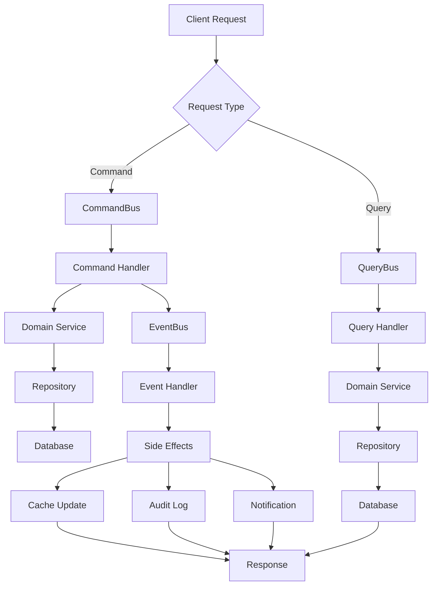

# CQRS Implementation for User Management

## 📋 Overview

CQRS (Command Query Responsibility Segregation) در سیستم User Management ما به صورت کامل پیاده‌سازی شده است. این الگو عملیات خواندن (Query) و نوشتن (Command) را از هم جدا می‌کند.

## 🏗️ Architecture

### 1. Commands (دستورات - نوشتن)

Commands برای عملیات نوشتن استفاده می‌شوند:

#### CreateUserCommand
```typescript
// ایجاد کاربر جدید
const command = new CreateUserCommand({
  email: 'user@example.com',
  firstName: 'John',
  lastName: 'Doe',
  phone: '+1234567890',
  role: UserRole.CUSTOMER,
  avatarUrl: 'https://example.com/avatar.jpg'
});

await commandBus.execute(command);
```

#### UpdateUserCommand
```typescript
// بروزرسانی کاربر
const command = new UpdateUserCommand({
  id: 'user-uuid',
  email: 'newemail@example.com',
  firstName: 'Jane'
});

await commandBus.execute(command);
```

#### ChangeUserRoleCommand
```typescript
// تغییر نقش کاربر
const command = new ChangeUserRoleCommand({
  id: 'user-uuid',
  role: UserRole.ADMIN
});

await commandBus.execute(command);
```

#### DeactivateUserCommand
```typescript
// غیرفعال کردن کاربر
const command = new DeactivateUserCommand({
  id: 'user-uuid'
});

await commandBus.execute(command);
```

### 2. Queries (پرس‌وجوها - خواندن)

Queries برای عملیات خواندن استفاده می‌شوند:

#### GetUserByIdQuery
```typescript
// دریافت کاربر بر اساس ID
const query = new GetUserByIdQuery({
  id: 'user-uuid'
});

const user = await queryBus.execute(query);
```

#### SearchUsersQuery
```typescript
// جستجوی کاربران
const query = new SearchUsersQuery({
  query: 'john doe'
});

const users = await queryBus.execute(query);
```

#### GetUserActivityQuery
```typescript
// دریافت وضعیت فعالیت کاربر
const query = new GetUserActivityQuery({
  id: 'user-uuid'
});

const activity = await queryBus.execute(query);
```

### 3. Events (رویدادها)

Events برای side effects و همگام‌سازی استفاده می‌شوند:

#### UserCreatedEvent
```typescript
// رویداد ایجاد کاربر
const event = new UserCreatedEvent(
  'user-uuid',
  'user@example.com',
  'John',
  'Doe',
  '+1234567890',
  UserRole.CUSTOMER,
  'https://example.com/avatar.jpg'
);

await eventBus.publish(event);
```

#### UserUpdatedEvent
```typescript
// رویداد بروزرسانی کاربر
const event = new UserUpdatedEvent(
  'user-uuid',
  'newemail@example.com',
  'Jane',
  'Doe',
  '+1234567890',
  'https://example.com/new-avatar.jpg'
);

await eventBus.publish(event);
```

#### UserRoleChangedEvent
```typescript
// رویداد تغییر نقش کاربر
const event = new UserRoleChangedEvent(
  'user-uuid',
  UserRole.CUSTOMER, // old role
  UserRole.ADMIN     // new role
);

await eventBus.publish(event);
```

## 🔄 Flow Diagram



## 🚀 How It Works

### 1. Command Flow

```typescript
// 1. Client sends command
const createUserDto = {
  email: 'user@example.com',
  firstName: 'John',
  lastName: 'Doe',
  phone: '+1234567890',
  role: UserRole.CUSTOMER
};

// 2. Controller receives request
@Post()
async createUser(@Body() createUserDto: CreateUserDto) {
  const command = new CreateUserCommand(createUserDto);
  return await this.commandBus.execute(command);
}

// 3. CommandBus routes to handler
async execute(command: CreateUserCommand) {
  return await this.createUserHandler.handle(command);
}

// 4. Handler processes command
async handle(command: CreateUserCommand) {
  // Business logic
  const user = await this.userService.createUser(command);
  
  // Publish event
  await this.eventBus.publish(new UserCreatedEvent(...));
  
  return user;
}
```

### 2. Query Flow

```typescript
// 1. Client sends query
const userId = 'user-uuid';

// 2. Controller receives request
@Get(':id')
async getUserById(@Param('id') id: string) {
  const query = new GetUserByIdQuery({ id });
  return await this.queryBus.execute(query);
}

// 3. QueryBus routes to handler
async execute(query: GetUserByIdQuery) {
  return await this.getUserByIdHandler.handle(query);
}

// 4. Handler processes query
async handle(query: GetUserByIdQuery) {
  return await this.userService.getUserById(query.id);
}
```

### 3. Event Flow

```typescript
// 1. Event is published
await eventBus.publish(new UserCreatedEvent(...));

// 2. EventBus routes to handler
async publish(event: UserCreatedEvent) {
  await this.userCreatedHandler.handle(event);
}

// 3. Handler processes event
async handle(event: UserCreatedEvent) {
  // Cache user data
  await this.redisService.set(`user:${event.userId}`, ...);
  
  // Add to search index
  await this.redisService.sAdd('user:search:index', event.userId);
}
```

## 🎯 Benefits

### 1. Separation of Concerns
- **Commands**: Business logic و validation
- **Queries**: Data retrieval و formatting
- **Events**: Side effects و notifications

### 2. Scalability
- **Commands**: می‌توانند به صورت async پردازش شوند
- **Queries**: می‌توانند از cache یا read replicas استفاده کنند
- **Events**: می‌توانند به صورت parallel پردازش شوند

### 3. Maintainability
- **Single Responsibility**: هر handler یک کار خاص انجام می‌دهد
- **Testability**: هر component به صورت مستقل قابل تست است
- **Extensibility**: افزودن handler جدید آسان است

### 4. Performance
- **Caching**: Queries می‌توانند از cache استفاده کنند
- **Optimization**: Commands و Queries می‌توانند به صورت جداگانه بهینه‌سازی شوند
- **Load Balancing**: می‌توانند روی سرورهای مختلف اجرا شوند

## 🔧 Configuration

### 1. Command Bus
```typescript
@Injectable()
export class CommandBus {
  async execute(command: CreateUserCommand): Promise<any>;
  async execute(command: UpdateUserCommand): Promise<any>;
  async execute(command: ChangeUserRoleCommand): Promise<any>;
  async execute(command: DeactivateUserCommand): Promise<void>;
}
```

### 2. Query Bus
```typescript
@Injectable()
export class QueryBus {
  async execute(query: GetUserByIdQuery): Promise<any>;
  async execute(query: SearchUsersQuery): Promise<any[]>;
  async execute(query: GetUserActivityQuery): Promise<{...}>;
}
```

### 3. Event Bus
```typescript
@Injectable()
export class EventBus {
  async publish(event: UserCreatedEvent): Promise<void>;
  async publish(event: UserUpdatedEvent): Promise<void>;
  async publish(event: UserRoleChangedEvent): Promise<void>;
}
```

## 📊 Monitoring

### 1. Command Metrics
- تعداد commands اجرا شده
- زمان اجرای commands
- نرخ خطای commands

### 2. Query Metrics
- تعداد queries اجرا شده
- زمان اجرای queries
- نرخ cache hit

### 3. Event Metrics
- تعداد events منتشر شده
- زمان پردازش events
- نرخ خطای events

## 🧪 Testing

### 1. Unit Tests
```typescript
describe('CreateUserHandler', () => {
  it('should create user successfully', async () => {
    const command = new CreateUserCommand({...});
    const result = await handler.handle(command);
    expect(result).toBeDefined();
  });
});
```

### 2. Integration Tests
```typescript
describe('UserCqrsController', () => {
  it('should create user via CQRS', async () => {
    const response = await request(app)
      .post('/users-cqrs')
      .send(createUserDto)
      .expect(201);
  });
});
```

## 🚀 Getting Started

### 1. Install Dependencies
```bash
bun install
```

### 2. Start Services
```bash
bun run docker:up
```

### 3. Run Application
```bash
bun run dev
```

### 4. Test CQRS
```bash
# Create user
curl -X POST http://localhost:3000/users-cqrs \
  -H "Content-Type: application/json" \
  -d '{"email":"user@example.com","firstName":"John","lastName":"Doe","phone":"+1234567890","role":"CUSTOMER"}'

# Get user
curl http://localhost:3000/users-cqrs/user-uuid

# Search users
curl http://localhost:3000/users-cqrs?q=john
```

## 📚 API Endpoints

### Commands
- `POST /users-cqrs` - Create user
- `PUT /users-cqrs/:id` - Update user
- `PUT /users-cqrs/:id/role` - Change user role
- `DELETE /users-cqrs/:id` - Deactivate user

### Queries
- `GET /users-cqrs/:id` - Get user by ID
- `GET /users-cqrs` - Search users
- `GET /users-cqrs/:id/activity` - Get user activity

## 🔍 Debugging

### 1. Enable Logging
```typescript
// In main.ts
app.useLogger(new Logger('BookingSystem'));
```

### 2. Monitor Events
```typescript
// Add event logging
await eventBus.publish(new UserCreatedEvent(...));
console.log('User created event published');
```

### 3. Check Cache
```typescript
// Check Redis cache
const cached = await redisService.get('user:user-uuid');
console.log('Cached user:', cached);
```

## 🎉 Conclusion

CQRS در سیستم User Management ما به صورت کامل پیاده‌سازی شده و مزایای زیر را ارائه می‌دهد:

- **جداسازی کامل** عملیات خواندن و نوشتن
- **قابلیت مقیاس‌پذیری** بالا
- **قابلیت نگهداری** آسان
- **عملکرد** بهینه
- **قابلیت تست** بالا

این پیاده‌سازی به شما امکان مدیریت کاربران با بالاترین کیفیت و کارایی را می‌دهد.
